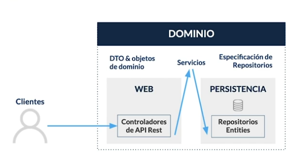

# Spring Framework
## Archivos de configuración y perfiles por ambientes:
- src->resources->application.properties
Aquí se puede crear archivos por ambiente de ejecución

Más parámetros de configuración en el siguiente link
[paŕametros de configuracion](https://docs.spring.io/spring-boot/index.html)

## Arquitectura del proyecto

## Spring DATA JPA
- Proyecto que internamente contiene otros
- Optimización de tareas repetitivas
- Repositorios sin código con JAPRepository, CrudRepository PagingAndSortingRepository
- Audotorias transparentes

## Scripts adjuntos
- Script de creación de tablas - schema.sql
- Scirpt de carga de datos - data.sql